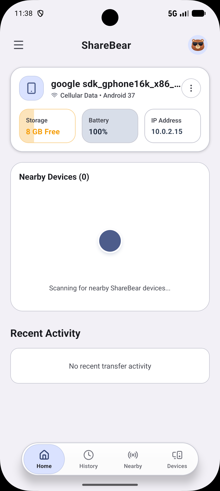
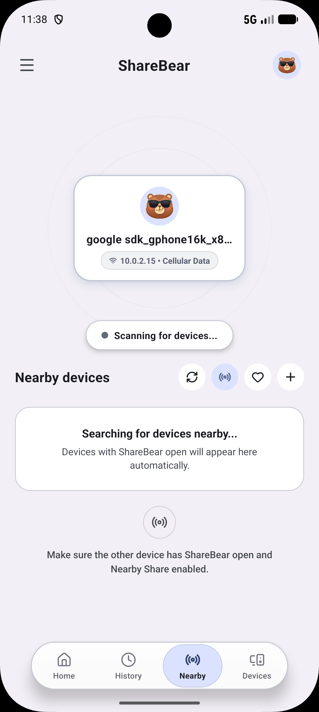
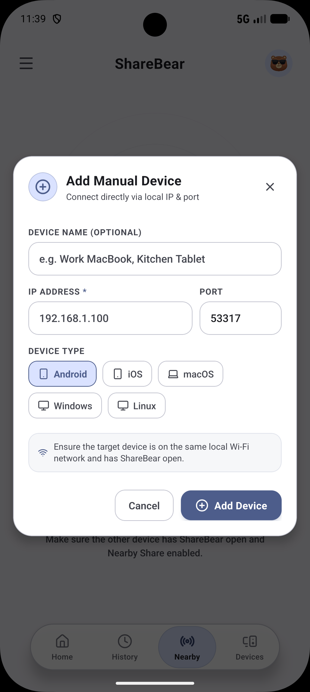
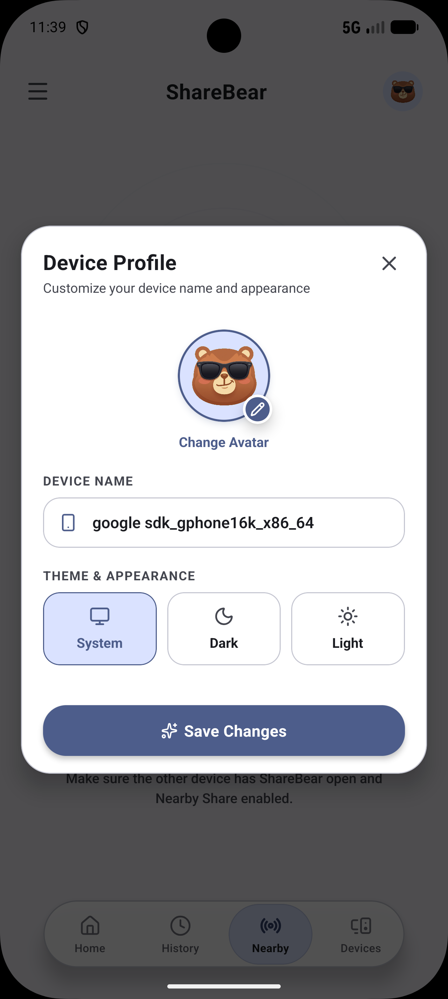
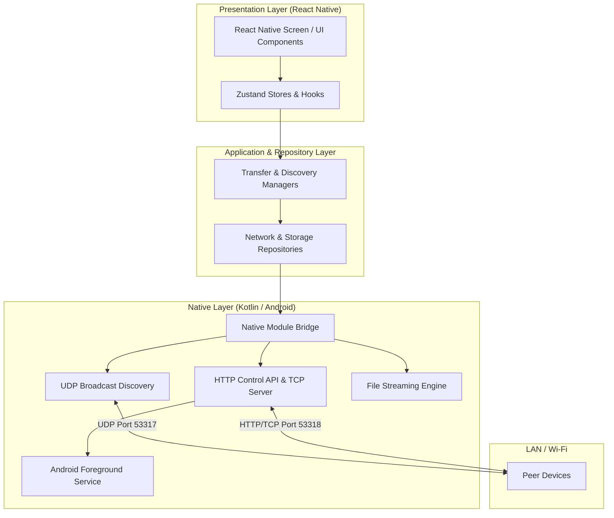

<div align="center">

  
  <h1>ShareBear</h1>
  <p><strong>Fast, Secure & Offline Peer-to-Peer LAN File Sharing Application</strong></p>

  <p>
    <a href="#-features">Features</a> •
    <a href="#-screenshots">Screenshots</a> •
    <a href="#-architecture">Architecture</a> •
    <a href="#-networking-protocol">Protocol</a> •
    <a href="#-getting-started">Getting Started</a> •
    <a href="#-roadmap">Roadmap</a> •
    <a href="#-contributing">Contributing</a>
  </p>

  <p>
    
    
    
    
    
  </p>

</div>

---

## 📌 Overview

**ShareBear** is an open-source, local-first file-sharing application inspired by LocalSend. Built with **React Native** and powered by a dedicated **native Kotlin networking engine**, ShareBear enables lightning-fast peer-to-peer file transfers over Wi-Fi / Local Area Network (LAN) without requiring an active internet connection or external cloud servers.

Whether you're sharing photos, documents, or large media files, ShareBear ensures maximum privacy, low latency, and zero data consumption by keeping all communication inside your local network.

---

## ✨ Features

- ⚡ **Zero Cloud / 100% Offline**: No internet required. Files transfer directly between devices on the same Wi-Fi/LAN.
- 🔍 **Automatic Peer Discovery**: Devices discover each other instantly using zero-configuration UDP broadcasts.
- 🚀 **High-Throughput Native Streaming**: Native Kotlin socket engine streams binary file data directly, bypassing JS bridge bottlenecks.
- 🛡️ **Consent & Privacy First**: Senders must request permission; receivers explicitly accept or decline transfer requests.
- 🎨 **Modern UI**: Clean, dynamic interface built with React Native, Zustand state management, and Lucide icons.
- 🔄 **Foreground Service Support**: Background transfer stability on Android via native foreground execution.
- 📡 **Versioned LAN Protocol**: Structured HTTP/JSON control messages with raw binary TCP chunking.

---

## 📱 App Screenshots

<div align="center">
  <table>
    <tr>
      <td align="center" width="25%">
        
        <br />
        <sub><b>Home Dashboard</b></sub>
      </td>
      <td align="center" width="25%">
        
        <br />
        <sub><b>Peer Discovery</b></sub>
      </td>
      <td align="center" width="25%">
        
        <br />
        <sub><b>Manual Connect</b></sub>
      </td>
      <td align="center" width="25%">
        
        <br />
        <sub><b>Profile & Settings</b></sub>
      </td>
    </tr>
  </table>
</div>

---

## 🏗️ Architecture

ShareBear enforces a strict separation of concerns: the presentation layer is decoupled from networking logic. The JavaScript layer handles state management and user interactions, while the native Android layer handles low-level networking, socket servers, and file I/O streams.



### Tech Stack

| Layer | Technology | Purpose |
| :--- | :--- | :--- |
| **Mobile UI** | React Native (TypeScript) | Cross-platform UI layout and interaction |
| **State Management**| Zustand + MMKV | High-performance reactive state & fast persistent storage |
| **Native Core** | Native Kotlin Modules | Socket management, UDP listening, file streaming |
| **Icons & UI** | Lucide React Native | Modern, responsive icon set |
| **Networking** | UDP Broadcast + HTTP/TCP | Zero-config discovery & raw binary file streaming |

---

## 📡 Networking Protocol

ShareBear uses a lightweight, versioned protocol over standard socket primitives:

| Service | Protocol | Default Port | Description |
| :--- | :--- | :--- | :--- |
| **Discovery** | UDP | `53317` | Broadcasts device info packets & listens for responses |
| **Control & API** | HTTP/JSON | `53318` | Device info exchange, file transfer requests/responses |
| **File Transfer** | HTTP/TCP Stream | `53318` | High-speed binary octet-stream chunk upload |

### Transfer Flow Sequence

```text
[Device A (Sender)]                          [Device B (Receiver)]
        │                                              │
        │─── UDP Discover Packet (Port 53317) ────────>│
        │<── UDP Discover Response (Port 53317) ───────│
        │                                              │
        │─── GET /info (Port 53318) ──────────────────>│
        │<── 200 OK (Capabilities) ────────────────────│
        │                                              │
        │─── POST /transfer/request (JSON Metadata) ──>│
        │                                       [Prompt User]
        │<── 200 OK (Accepted / Declined) ─────────────│
        │                                              │
        │─── POST /transfer/{id}/file (Binary Stream) >│
        │<── 200 OK (File Received) ───────────────────│
        │                                              │
        │─── POST /transfer/{id}/complete ────────────>│
```

---

## 📁 Project Structure

```text
ShareBear/
├── android/               # Native Android project (Kotlin engine, Foreground Service)
├── ios/                   # Native iOS project setup
├── docs/                  # Architectural documentation & technical specs
│   ├── Architecture.md    # Detailed layer design & component responsibilities
│   ├── NetworkProtocol.md # Complete HTTP/UDP packet specs & endpoint docs
│   └── Roadmap.md         # Detailed milestone tracking
├── src/
│   ├── app/               # Main Application entry and providers
│   ├── assets/            # Static assets and graphics
│   ├── components/        # Reusable UI components
│   ├── features/          # Feature-based business logic (discovery, transfer)
│   ├── hooks/             # Custom React hooks
│   ├── native/            # React Native bridge wrappers
│   ├── navigation/        # React Navigation stack definitions
│   ├── repositories/      # Network, storage, and preference repositories
│   ├── screens/           # Application screens (Home, Devices, Transfer, Settings)
│   ├── services/          # Core background services
│   ├── store/             # Zustand state slices (DeviceStore, TransferStore)
│   ├── types/             # TypeScript type definitions and interfaces
│   └── utils/             # Helper utilities and formatters
├── index.js               # Entry point for React Native Metro
└── package.json           # Project manifests and scripts
```

---

## 🚀 Getting Started

### Prerequisites

Ensure you have the following installed on your development machine:
- **Node.js**: `>= 22.11.0`
- **JDK**: `17` or higher
- **Android SDK** (for Android development)
- **CocoaPods** & **Xcode** (for iOS development on macOS)

### Installation

1. **Clone the repository:**
   ```bash
   git clone https://github.com/Amrindergill666/ShareBear.git
   cd ShareBear
   ```

2. **Install JavaScript dependencies:**
   ```bash
   npm install
   ```

3. **Start the Metro Bundler:**
   ```bash
   npm start
   ```

4. **Run on Android:**
   Open a separate terminal and run:
   ```bash
   npm run android
   ```

5. **Run on iOS (macOS only):**
   ```bash
   cd ios && bundle exec pod install && cd ..
   npm run ios
   ```

---

## 🗺️ Roadmap

- [x] **Phase 1: MVP Core**
  - [x] UDP peer discovery on local network
  - [x] HTTP JSON control handshake
  - [x] High-speed native Kotlin binary file streaming
  - [x] Progress tracking & UI updates via Zustand
- [ ] **Phase 2: Security & Resumption**
  - [ ] TLS / End-to-End Encryption
  - [ ] QR Code pairing for zero-trust networks
  - [ ] Resumable file transfers for interrupted connections
- [ ] **Phase 3: Extended File Support**
  - [ ] Folder transfer support & zip compression
  - [ ] Multi-file batch selection & queue management
- [ ] **Phase 4: Ecosystem Expansion**
  - [ ] Desktop applications (macOS, Windows, Linux)
  - [ ] Modular **ShareBear Core** C++/Kotlin engine for CLI clients

---

## 🤝 Contributing

Contributions are always welcome! If you'd like to report a bug, suggest a feature, or submit a pull request:

1. Fork the project repository.
2. Create your feature branch (`git checkout -b feature/AmazingFeature`).
3. Commit your changes (`git commit -m 'Add some AmazingFeature'`).
4. Push to the branch (`git checkout -b feature/AmazingFeature`).
5. Open a Pull Request.

---

## 📄 License

Distributed under the **MIT License**. See `LICENSE` for more information.

---

<div align="center">
  <sub>Built with ❤️ for privacy, performance, and seamless local file sharing.</sub>
</div>
